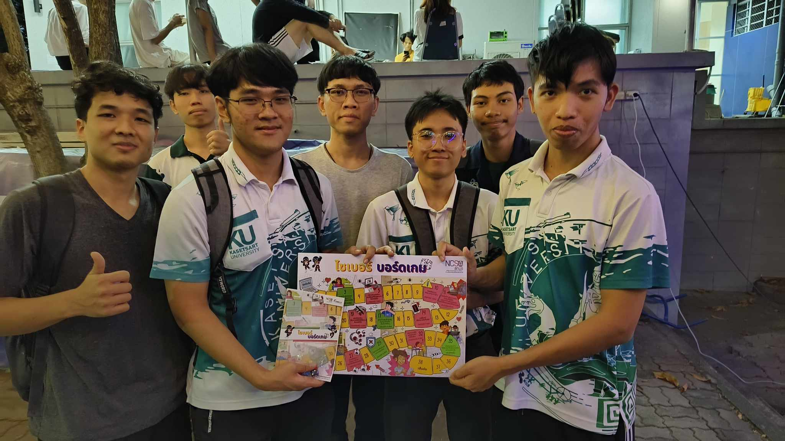

# Board Game 
## Group : Kraprao Mhookrob Kaidao 

**รายละเอียดของกิจกรรม** : กิจกรรมนี้จัดขึ้นโดย สำนักงานคณะกรรมการการรักษาความมั่นคงปลอดภัยไซเบอร์ (สกมช.)เพื่อสร้างความตระหนักรู้และทักษะด้านการรักษาความมั่นคงปลอดภัยไซเบอร์ให้กับเด็กและเยาวชน
                     โดยกลุ่มของผมได้ทำการหาผู้ที่มีความสนใจในการเล่นและได้ขออนุญาติในการถ่ายวิดิโอจากผู้เข้าร่วมกิจกรรมแล้วโดยเราได้ทำการถ่ายทำการเล่น board game เมื่อวันที่ 21 ธันวาคม 2566 โดย                      ได้มีการเล่นที่บริเวณตึก 9 ของมหาวิทยาลัยเกษตรศาสตร์ วิทยาเขตศรีราชา

### เพื่อนร่วมอุดมการณ์

1. [Amarin Yaowarod](https://6530200908.github.io/)

2. [Panupong Thondcherd](https://6530200339.github.io/)

3. [Kasidid Yookong](https://kasidid-y.github.io/)

4. [Suphanimit Nilchawee](https://6530200517.github.io/)

[ภาพและวิดีโอ](https://drive.google.com/drive/folders/1j_I0HOPhD_l8EV1F_v9PA3OFqQt7RYgT)

