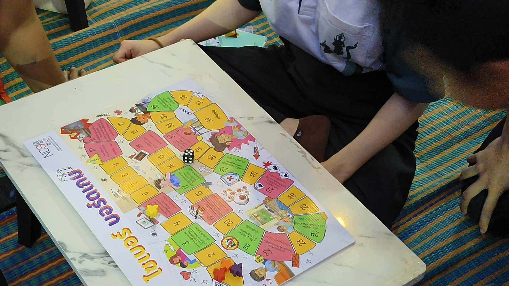
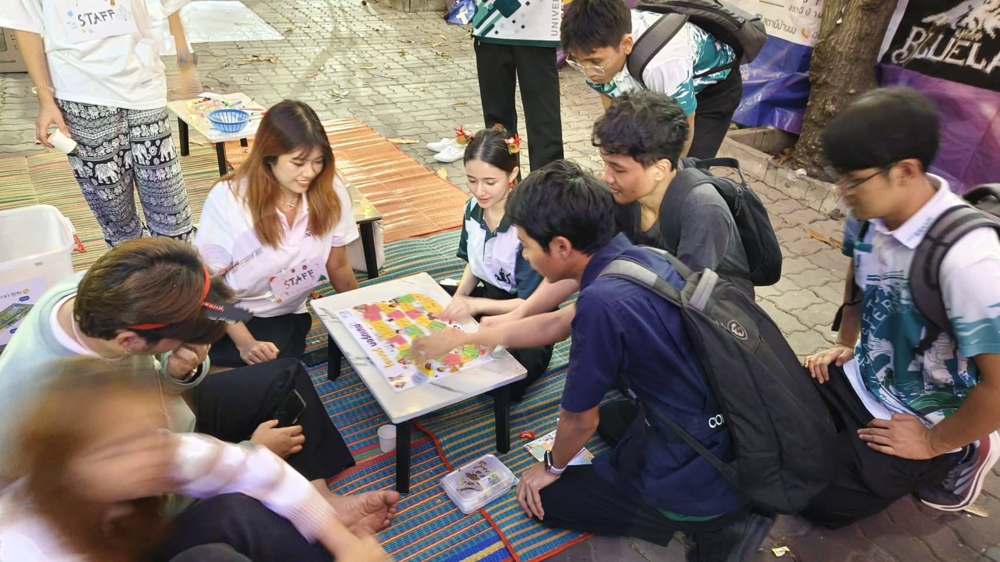

# Board Game 
## Group : Kraprao Mhookrob Kaidao 

**รายละเอียด** : กิจกรรมนี้จัดขึ้นโดยกลุ่ม "Kraprao Mhookrob Kaidao" ซึ่งเป็นนิสิตสาขา Computer Science โดยใช้บอร์ดเกมของสำนักงานคณะกรรมการการรักษาความมั่นคงปลอดภัยไซเบอร์ (สกมช.) เพื่อสร้างความตระหนักรู้และเสริมสร้างทักษะด้านการรักษาความมั่นคงปลอดภัยไซเบอร์ให้กับเด็กและเยาวชน

โดยกลุ่มของพวกเราได้รับความสนใจจากสมาชิกของสภานิสิตในการเล่นและได้ขออนุญาตในการถ่ายวิดิโอจากผู้เข้าร่วมกิจกรรมแล้วซึ่งมีผู้เล่นทั้งหมด 4 คน(ผู้เล่น 2 คน และสมาชิกในกลุ่ม 2 คน)ในระหว่างทำกิจกรรมได้มีการพูดถึงกฎหมายต่าง ๆ ที่เกี่ยวข้องกับบอร์ดเกม 

การถ่ายทำกิจกรรมดังกล่าวจัดขึ้นเมื่อวันที่ 21 ธันวาคม 2566 เวลาประมาณ 19.00 น. ณ บริเวณ ตึก 9 มหาวิทยาลัยเกษตรศาสตร์ วิทยาเขตศรีราชา

[บรรยากาศการทำกิจกรรม(Video)](https://www.youtube.com/watch?v=UAQ9AiV6jmU)

### เพื่อนร่วมอุดมการณ์

1. [Amarin Yaowarod](https://6530200908.github.io/boardgame)

2. [Panupong Thongcherd](https://6530200339.github.io/boardgame)

3. [Kasidid Yookong](https://kasidid-y.github.io/boardgame)

4. [Suphanimit Nilchawee](https://6530200517.github.io/boardgame)

[Back to my profile](https://qlerdev.github.io/)

