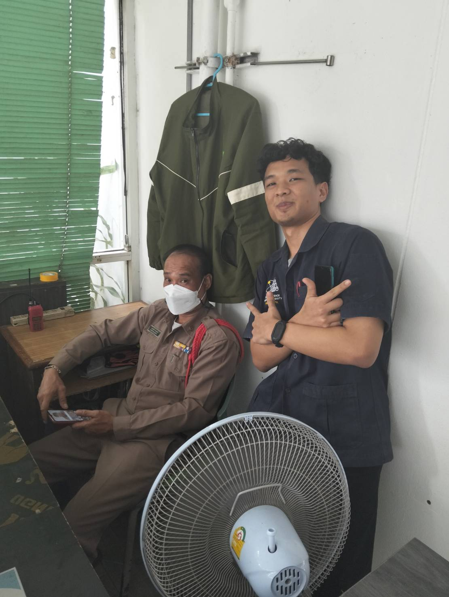

# Security Control 
## 
### ยามประจำหอพัก
#### สถานที่ : หอพักนักศึกษา ตึก 3 หอชาย

##### control function : preventive control 

#### Type of Security Control : Physical Control

เหตุผล : การมียามประจำหอพักถือเป็น Security Control ในรูปแบบของ Physical Control ซึ่งเน้นการป้องพื้นที่จากภัยคุกคามทางกายภาพ เช่น การบุกรุก การโจรกรรม โดยการใช้เจ้าหน้าที่ในการดูแลตรวจสอบ
คอยเฝ้าระวัง และควบคุมการเข้า-ออกของนิสิต หรือบุคคลต่างๆ และในส่วนของ Control Function จะเป็น preventive control sinvการควบคุมที่มุ่งเน้นการป้องกันเหตุการณ์ไม่พึงประสงค์ เช่น การป้องกันการบุกรุกหรือเหตุการณ์ที่ไม่ปลอดภัย
